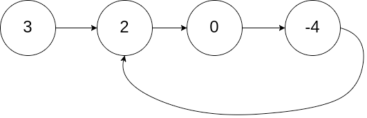

# Algorithms - Concepts & Terminology

## **Floyd's Cycle Finding ("Hare-Tortoise") Algorithm**

- use of two pointers, one with slow speed and one with fast speed to traverse a **linked list** to detect for any cycles
- the idea is that if there is a **cycle** in the linked list where the tail node's reference pointer points to a node that has already been traversed, both pointers will eventually meet on the same node

Given a `ListNode` of `[3, 2, 0, -4]` with an internal `pos` or "position" parameter of `1` (this represents the _index_ of the node that the tail node points to), you can use this algorithm to check to see if there is a cycle.



Recall traversing a LinkedList is just `head.next` or `head.next.next` if you want to traverse 2 nodes per iteration given the following definition of a `ListNode`:

```python
class ListNode(object):
    def __init__(self, x):
        self.val = x
        self.next = None
```
A working solution with time complexity of `O(n)` and space complexity of `O(1)`:

```python

class Solution(object):
    def hasCycle(self, head):
        """
        :type head: ListNode
        :rtype: bool
        """
        # init pointers
        slow_pointer = head
        fast_pointer = head

        # traverse list with both pointers at diff speeds
        while fast_pointer is not None and fast_pointer.next is not None:
            slow_pointer = slow_pointer.next
            fast_pointer = fast_pointer.next.next 

            # both pointers meet up at same node --> cycle exists
            if slow_pointer == fast_pointer:
                return True
        # both pointers never meet up --> cycle does not exist
        return False
```
As the number of nodes `n` in the linked list grows, the longer it will take for this algo to finish executing. 

In a non-cyclic linked list, the fast pointer would induce a time complexity of `O(n/2)`; however, this wouldn't affect the overall algorithm's time complexity, thus remain `O(n)` due to the slow pointer's linear traversal through the list. **Recall that constants are _disregarded_ in Big Notation; we're more focused on the _upper bound_ of time complexity.**

As for the space complexity, the space used does not scale with `n`; only a fixed number of pointers (variables) are used regardless of the list size, thus remains constant.